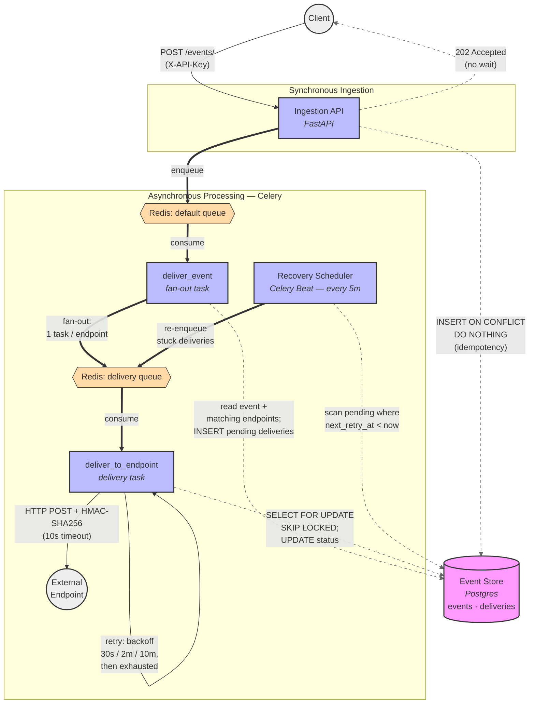

# webhook-delivery-service

Production-grade webhook delivery infrastructure for multi-tenant event ingestion,
reliable HTTP delivery, retries, HMAC signing, and crash recovery.

Stack: FastAPI, PostgreSQL, Redis, Celery, and Docker Compose.

## Links

- [Architecture](#architecture)
- [Local Setup](#local-setup)
- [Architecture Decisions](docs/adr/)
- [Known Gaps](docs/known-gaps.md)

## Architecture



### Diagram legend

- **Solid / thick arrows** — task, message, and request flow (the delivery pipeline).
- **Dashed arrows** — Postgres reads and writes. Postgres is the source of truth; all delivery state lives there.
- **Pink** = storage, **blue** = compute, **orange** = Redis queues, **grey** = external actors.

## How it works

1. **Ingestion (synchronous).** A client calls `POST /events/` with an `X-API-Key`. FastAPI authenticates the tenant and runs `INSERT ... ON CONFLICT DO NOTHING` for idempotency, then enqueues a `deliver_event` task and returns `202 Accepted` without waiting for delivery.
2. **Fan-out.** `deliver_event` (on the `default` queue) reads the event and the tenant's matching endpoints, inserts one `pending` delivery row per endpoint, and dispatches one `deliver_to_endpoint` task per delivery to the `delivery` queue.
3. **Delivery.** `deliver_to_endpoint` (on the `delivery` queue) locks the delivery row with `SELECT ... FOR UPDATE SKIP LOCKED`, re-fetches fresh endpoint/event state, signs the payload with HMAC-SHA256, and POSTs to the endpoint with a 10s timeout. Success marks the row `success`.
4. **Retry.** Failures retry with exponential backoff (30s / 2m / 10m). After three attempts the row is marked `exhausted`.
5. **Recovery.** `Celery Beat` runs `recover_stuck_deliveries` every 5 minutes, scanning for `pending` rows whose `next_retry_at` is in the past and re-enqueueing them.

> The two Celery queues are isolated on purpose: a backlog of slow outbound HTTP calls on the `delivery` queue never blocks event ingestion via the `default` queue.

## Local Setup

Create your local `.env` file:

```bash
cp .env.example .env
```

Build and start the local Docker stack:

```bash
docker compose up -d --build
```

Seed local development data from inside the API container:

```bash
docker compose exec api python -m app.scripts.seed
```

Reset the database and seed fresh data:

```bash
docker compose exec api python -m app.scripts.seed --reset
```

## Run Tests

Start required services:

```bash
docker compose up -d postgres redis
```

Create test database once:

```bash
docker compose exec postgres psql -U postgres -c "CREATE DATABASE test_webhookdb;"
```

Run the test suite:

```bash
uv run pytest
```

## Migrations

```bash
docker-compose exec api alembic revision --autogenerate -m "your message"
docker-compose exec api alembic upgrade head
```
